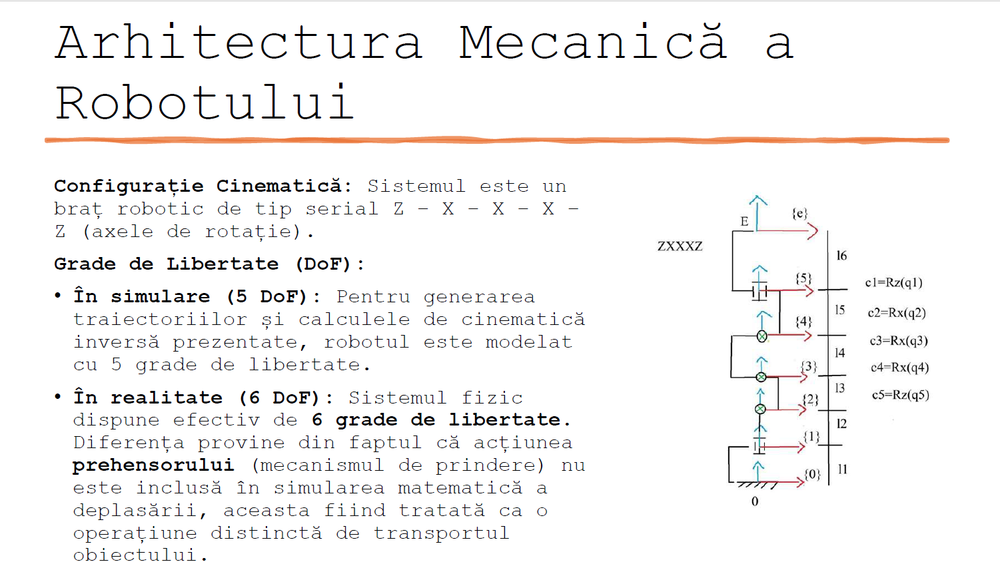
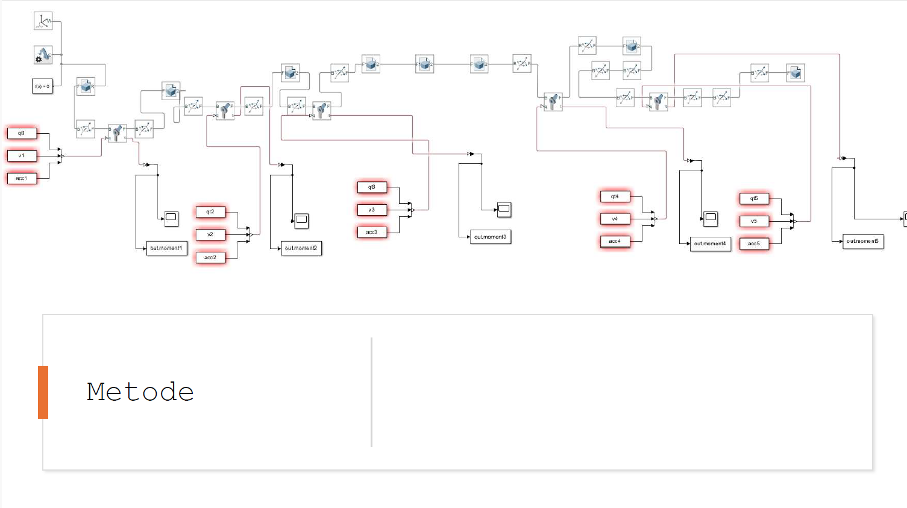
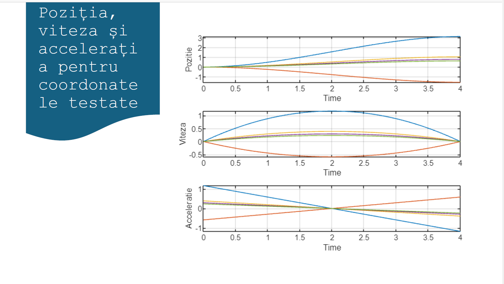
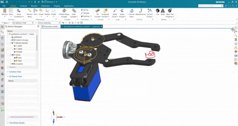
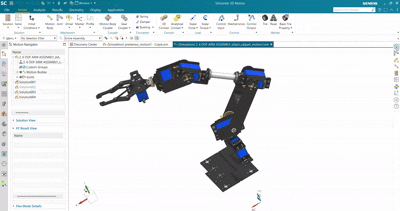

# Pick and Place Robotic Arm Simulation in Simulink

## Overview
This repository contains a research and simulation project for a "Pick and Place" robotic arm, developed in MATLAB/Simulink.The virtual open-source model used in the simulation is built at a 1:1 scale relative to the existing physical robot.

The main objective is to move the end-effector from Point A (Pickup) to Point B (Placement) within a 4-second timeframe, synchronizing the movement of all joints. 

## Mechanical Architecture & Trajectory
* **Architecture:** The robot features a Z-X-X-X-X serial chain configuration.
* **Degrees of Freedom (DoF):** The model operates with 5 DoF within the simulation for trajectory generation and inverse kinematics, while the physical robot has 6 DoF (the gripper mechanism is treated as a separate transport operation).
* **Trajectory Planning:** The movement utilizes a 3rd-order polynomial interpolation. The equation of motion is calculated to satisfy zero velocity and position conditions at the endpoints: 
  $Q(t) = a_3 t^3 + a_2 t^2 + a_1 t + a_0$

## Simulation Methods
The project explores six distinct simulation methods to validate the control architecture and kinematic models.

* **Method 1 (Direct Kinematics to Torque):** Inputs kinematic parameters (position, velocity, acceleration) directly into the joints to output the required torque
* **Method 2 (Torque to Position):** The reverse of Method 1; inputs torque to calculate the physical positional response (noted to cause an unstable "helicopter effect" during testing).
* **Method 3 (Motor-Reducer Models):** Introduces motor-reducer models where calculated torques act as external loads, simulating the real effort required to overcome inertia and the arm's weight using default PID parameters.
* **Method 4 (Phantom Model):** Runs forward and inverse dynamic models simultaneously to eliminate the need for explicit inertia, Coriolis, and gravitational matrix calculations, using a P-controller (Kp = 10000, Ki = 0).
* **Method 5 (Direct Acceleration):** A variation of the Phantom Model that directly integrates acceleration from the summation point.
* **Method 6 (PID Control):** Utilizes a PID regulator (Kp = 100) focusing strictly on correlating the system's positional response with the execution time window.

## Visuals

## Conclusions & Future Improvements
During the visual simulation, an assembly constraint issue was identified where the screws rotated alongside the moving joints instead of remaining fixed to the structure. Additionally, signal noise was observed in the velocity and acceleration outputs across several methods. 

Future improvements will focus on:
1. Correcting the rigid constraints of the hardware fasteners.
2. Implementing digital Low-Pass filters to optimize noise reduction on the velocity and acceleration signals.

# Simulation Animations

To better visualize the robot, it was also simulated in **Simcenter 3D**. Below are the animations demonstrating the synchronized movement of the robotic arm in action.

